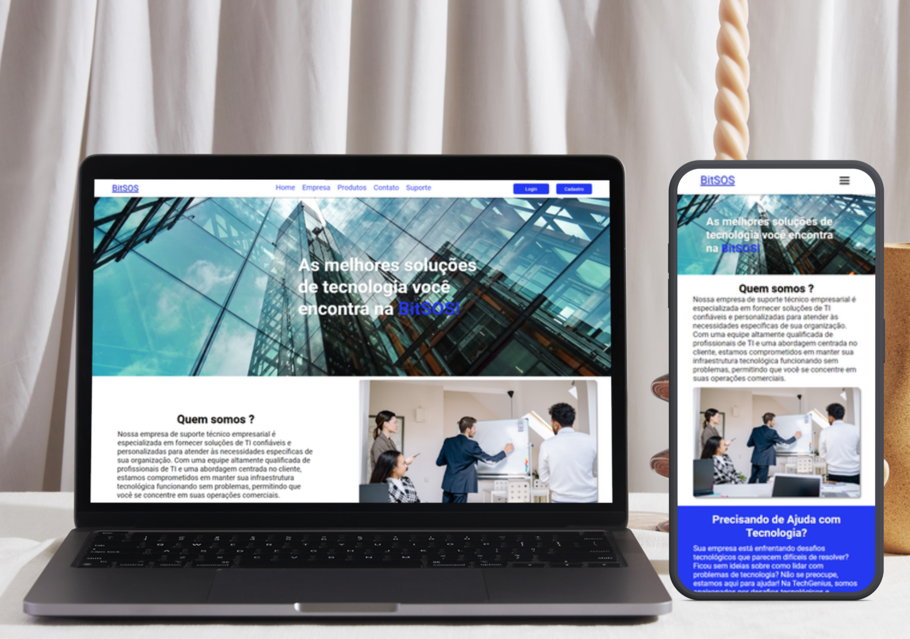

# BitSOS - Projeto Acadêmico de Design Responsivo

Bem-vindo ao BitSOS, um projeto acadêmico focado em design responsivo e desenvolvimento web. O BitSOS foi desenvolvido como parte do meu curso e representa um esforço para aprender e aplicar conceitos essenciais de design responsivo, HTML, CSS e JavaScript.

## Sobre o Projeto

O BitSOS foi concebido com a ideia de fornecer uma experiência perfeita tanto em dispositivos móveis quanto em desktops. Inicialmente, seguimos a abordagem "Mobile First" e, posteriormente, adaptamos o design para telas maiores. Além disso, implementamos o botão "hamburguer" usando JavaScript para melhorar a navegação em dispositivos móveis.

## Recursos e Destaques

- **Design Responsivo:** O BitSOS oferece uma experiência de usuário consistente em telas de diferentes tamanhos.
- **Botão "Hamburguer":** A navegação móvel é simplificada com um botão de menu "hamburguer".

## Tecnologias Utilizadas

- HTML
- CSS
- JavaScript

## Como Visualizar o BitSOS

Você pode conferir o BitSOS ao vivo no seguinte link: [BitSOS Hospedagem no GitHub](https://mattheus910.github.io/bitsos/#).

## Contribuições

Contribuições são bem-vindas! Sinta-se à vontade para abrir problemas (issues) ou enviar pull requests para aprimorar o projeto.

## Contato

Se você tiver algum feedback, dúvida ou quiser saber mais sobre o projeto, sinta-se à vontade para entrar em contato:

- [Matheus Martins] - [matheusmartins910@gmail.com]
- [Seu LinkedIn](www.linkedin.com/in/mattheus910)
- [Seu GitHub](https://github.com/Mattheus910)

Agradeço por conferir o BitSOS!

